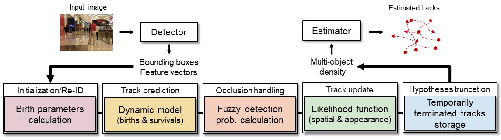

# Visual RFS

This is the official Python and C++ implementation repository for a paper entitled "Visual Multi-Object Tracking with Re-Identification and Occlusion Handling using Labeled Random Finite Sets", *Pattern Recognition* ([arXiv 2405.18606](http://arxiv.org/abs/2405.18606)), ([MOTChallenge](https://motchallenge.net/method/MOT=8697&chl=5)).




### Quick Overview
- Exploiting object feature improves tracking performance of labeled random finite set filters (GLMB and LMB filters) by improving data association.
- Using object deep feature is effective for re-ID tasks.
- Fuzzy occlusion handling model improves tracking performance. 

### Docker image
Docker image to run VisualRFS codes can be found in [Docker Hub]().

### Usage
1. **Set Up Python Environment**
    - Create a `conda` Python environment and activate it:
        ```sh
        conda create --name virtualenv python==3.7.16
        conda activate virtualenv
        ```
    - Clone this repository recursively to have **fuzzylite**, and **pybind11**
        ```sh
        git clone --recursive https://github.com/linh-gist/visualrfs.git
        ```

2. **Install Packages**
    - C++ Packages ([Make sure `Eigen 3.4.0` is installed](src/cpputils/README.md)): Navigate to the `src/cpputils` folder and run `python setup.py build develop`
    - Python Packages: `pip install -r requirements.txt`

3. **Configure Experiment Options**   
Change the following options when initializing `GLMB` or `LMB` tracker
    - C++ `GLMB(int width, int height, bool useFeat = true, bool useFuzzyPD = false)`
    - C++ `LMB(int width, int height, bool useFeat = true, bool useFuzzyPD = false)`
    - Python `LMB: def __init__(self, use_feat=True)`
    - Python `GLMB:  def __init__(self, width, height, use_feat=True)`

4. **Prepare Data**
    - Datasets: 
        - MOTChallenge datasets ([MOT16](https://motchallenge.net/data/MOT16/), [MOT17](https://motchallenge.net/data/MOT17/), [MOT20](https://motchallenge.net/data/MOT20/))
        - You can run on your own dataset with your preference object detector
    - Folder structure:
        ```
        |-- detection
        |   |-- detector_fairmot256
        |   |   |-- MOT16-01.npz
        |   |   |-- MOT16-02.npz
        |   |   |   ...
        |   |   |-- MOT16-14.npz
        |   |-- detector_fairmot256
        |   |   |-- MOT20-01.npz
        |   |   |-- ...
        |   |   |-- MOT20-08.npz
        |-- src
        |   |-- cpputils
        |   |-- joint_glmb
        |   |-- joint_lmb
        |   |-- tracking_utils
        |-- requirements.txt
        |-- README.md
        ```
    - OSPA2 is re-implemented in Python and following this paper, an example code is given in `ospa2.py`.
        ```
        @article{rezatofighi2020trustworthy,
          title={How trustworthy are the existing performance evaluations for basic vision tasks?},
          author={Tran Thien Dat Nguyen and Hamid Rezatofighi and Ba-Ngu Vo and Ba-Tuong Vo and Silvio Savarese and Ian Reid},
          journal={IEEE Transactions on Pattern Analysis and Machine Intelligence},
          year={2022}
        }
        ```

5. **Run the Tracking Demo**
   - Navigate to the [`joint_glmb`](src/joint_glmb) or [`joint_lmb`](src/joint_lmb) and run `python run_joint_glmb.py` OR `python run_joint_lmb.py`.


### Contact
Linh Ma (linh.mavan@gm.gist.ac.kr), Machine Learning & Vision Laboratory, GIST, South Korea

### Citation
If you find this project useful in your research, please consider citing by:

```
@article{van2024visual,
      title={Visual Multi-Object Tracking with Re-Identification and Occlusion Handling using Labeled Random Finite Sets}, 
      author={Linh~Van~Ma and Tran~Thien~Dat~Nguyen and Changbeom~Shim and Du~Yong~Kim and Namkoo~Ha and Moongu~Jeon},
      journal={Pattern Recognition},
      volume = {156},
      year={2024},
      publisher={Elsevier}
}
```
